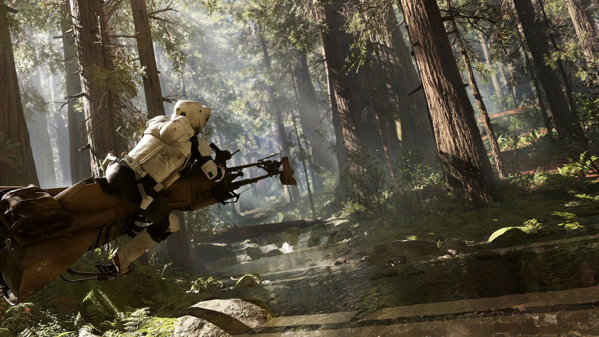

<h1 align="center">Hello there, I'm Lucas Ribette ⚔️</h1>

Student at 42 Le Havre, I'm passionate about IT, and more specifically, all things web and application related. I love to create elegant and feature-rich projects.

**`I'm currently looking for a 6-month internship in Le Havre.`**

 

<h2 align="center">🔧 Languages && Tools ⚙️</h2>

  

 

<h2 align="center">📈 Stats</h2>

  

<!--   -->

  

